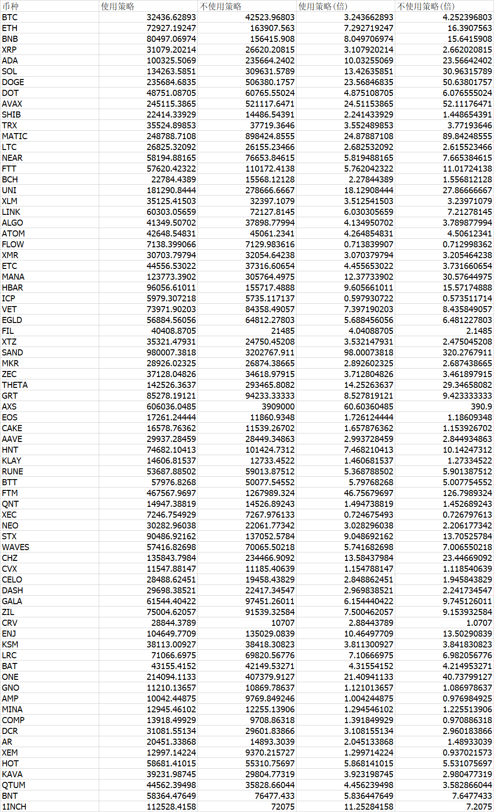
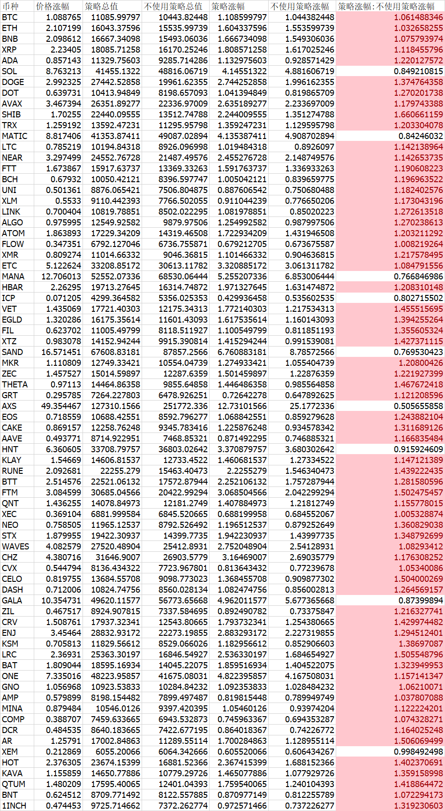
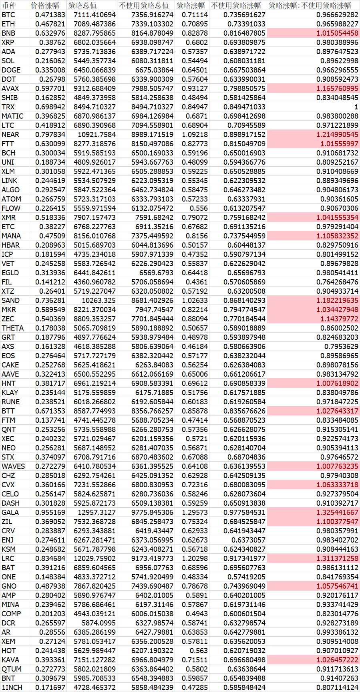

全局初始设置

    资金: 10000 
    比例: 50%:50% 
    间隔: 1小时
    触发平衡价格波动:30%

测试 牛市:

    时间: 2020 1-1 --- 2022 1-1

测试2 横盘:

    时间: 2021 1-1 --- 2022 1-1

测试2 熊市:

    时间: 2021 11-1 --- 2022 5-1

初步结论: 并不是所有时间都适合使用策略的 牛熊都不合适 所以要是觉得接下来不是横盘还是不要开策略跑了 多币种混合策略比较复杂 暂未测试